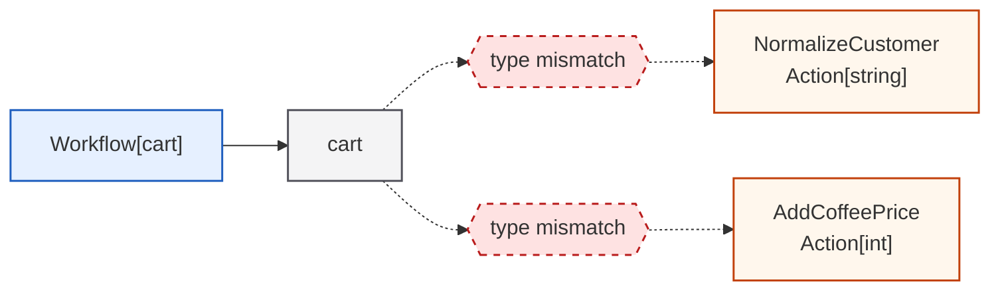
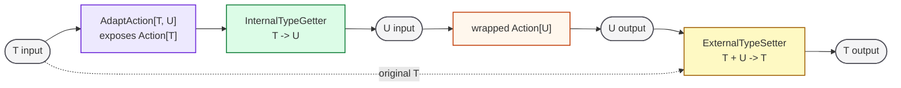
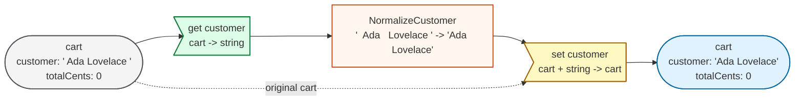
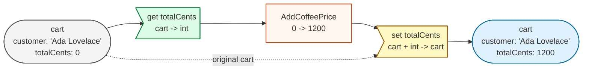

# Type Adaptation in Chain: A Case Study with a Shopping Cart

Full implementation: [cart.go](cart.go)

Go's type system and generics make `Action[T]` strongly typed. This is useful
because a `Workflow[cart]` cannot accidentally run an action that expects the
wrong input type.

The tradeoff is that existing actions for specific types cannot be used
directly inside a workflow that carries an aggregate type.

For example, this cart workflow state contains both a customer name and an item
count:

```go
type cart struct {
    customer   string
    totalCents int
}
```

The useful actions are smaller than the aggregate:

```go
func newNormalizeCustomerAction(name string) chain.Action[string]
func newAddPriceAction(name string, cents int) chain.Action[int]
```

Without adaptation, there are only two poor options:

- make every action accept `any`, losing compile-time type checking
- rewrite each existing `Action[string]` and `Action[int]` as an `Action[cart]`

`AdaptAction` provides a third option. It keeps the workflow type-safe while
allowing existing actions to operate on one internal value of the aggregate.

## Internal Getter and External Setter

`AdaptAction` is built around two small functions:

```go
type InternalTypeGetter[T any, U any] func(T) U
type ExternalTypeSetter[T any, U any] func(T, U) T
```

For an aggregate type `T` and an internal type `U`:

- the getter extracts the `U` value from `T`
- the wrapped `Action[U]` runs against that extracted value
- the setter writes the resulting `U` value back into `T`

Before adaptation, the type boundary is the problem. A cart workflow accepts and
returns `cart`, but the existing action accepts and returns only one internal
type.



`AdaptAction` changes the action boundary. The wrapped action still processes
only `U`, but the outer action now accepts and returns `T`.



Inside `typeAdapterAction.Run`, that graph becomes three steps:

```go
actualInput := a.getter(input)
actualOutput, err := a.action.Run(ctx, actualInput)
output = a.setter(output, actualOutput)
```

## Adapting Customer Name

The customer normalizer is an `Action[string]`. The cart workflow needs an
`Action[cart]`.

```go
func customerToCart(action chain.Action[string]) chain.Action[cart] {
    return chain.AdaptAction(
        action,
        func(c cart) string { return c.customer },
        func(c cart, customer string) cart {
            c.customer = customer
            return c
        },
    )
}
```

The getter selects `cart.customer`. The setter writes the normalized customer
name back into the cart.

For one input cart, the adapted action behaves like this:



## Adapting Total Price

The price action is an `Action[int]`, so it adapts through the same pattern:

```go
func totalCentsToCart(action chain.Action[int]) chain.Action[cart] {
    return chain.AdaptAction(
        action,
        func(c cart) int { return c.totalCents },
        func(c cart, totalCents int) cart {
            c.totalCents = totalCents
            return c
        },
    )
}
```

The price action has the same outer shape, but the internal value is `int`.



## Cart Workflow

After adaptation, the workflow can stay strongly typed as `Workflow[cart]`:

```go
workflow := chain.NewWorkflow(
    "CartAdapter",
    customerToCart(newNormalizeCustomerAction("NormalizeCustomer")),
    totalCentsToCart(newAddPriceAction("AddCoffeePrice", 1200)),
    totalCentsToCart(newAddPriceAction("AddFilterPrice", 300)),
)
```

The workflow executes as a single cart pipeline, even though its member actions
operate on different internal types.

```mermaid
graph LR;
    classDef aggregateNode fill:#f4f4f5,stroke:#52525b,stroke-width:1.5px;
    classDef getterNode fill:#dcfce7,stroke:#15803d,stroke-width:1.5px;
    classDef actionNode fill:#fff7ed,stroke:#c2410c,stroke-width:1.5px;
    classDef setterNode fill:#fef9c3,stroke:#a16207,stroke-width:1.5px;
    classDef outputNode fill:#e0f2fe,stroke:#0369a1,stroke-width:1.5px;

    start(["cart<br/>customer: '  Ada   Lovelace '<br/>totalCents: 0"]):::aggregateNode
    subgraph normalize["customerToCart(NormalizeCustomer)"]
        nGet>"get customer"]:::getterNode
        nRun["Action[string]"]:::actionNode
        nSet>"set customer"]:::setterNode
        nGet --> nRun
        nRun --> nSet
    end
    subgraph coffee["totalCentsToCart(AddCoffeePrice)"]
        cGet>"get totalCents"]:::getterNode
        cRun["Action[int]"]:::actionNode
        cSet>"set totalCents"]:::setterNode
        cGet --> cRun
        cRun --> cSet
    end
    subgraph filter["totalCentsToCart(AddFilterPrice)"]
        fGet>"get totalCents"]:::getterNode
        fRun["Action[int]"]:::actionNode
        fSet>"set totalCents"]:::setterNode
        fGet --> fRun
        fRun --> fSet
    end
    endNode(["cart<br/>customer: 'Ada Lovelace'<br/>totalCents: 1500"]):::outputNode

    start --> nGet
    nSet --> cGet
    cSet --> fGet
    fSet --> endNode
```



`TestCartAdapter` verifies this path:

```text
{customer: "  Ada   Lovelace ", totalCents: 0}
-> NormalizeCustomer
-> AddCoffeePrice
-> AddFilterPrice
-> {customer: "Ada Lovelace", totalCents: 1500}
```

## Adapting a Workflow as an Action

`Workflow` also implements `Action`, so a whole `Workflow[int]` can be adapted
into `Action[cart]`.

```go
addBundle := chain.NewWorkflow(
    "AddBundle",
    newAddPriceAction("AddCoffeePrice", 1200),
    newAddPriceAction("AddFilterPrice", 300),
    newAddPriceAction("AddMugPrice", 1500),
)

workflow := chain.NewWorkflow(
    "BundleCart",
    customerToCart(newNormalizeCustomerAction("NormalizeCustomer")),
    totalCentsToCart(addBundle),
)
```

The outer workflow still carries `cart`, while the nested workflow only sees
the internal `totalCents`. The adapter wraps the whole nested workflow the same
way it wraps a single action.

```mermaid
graph LR;
    classDef aggregateNode fill:#f4f4f5,stroke:#52525b,stroke-width:1.5px;
    classDef getterNode fill:#dcfce7,stroke:#15803d,stroke-width:1.5px;
    classDef actionNode fill:#fff7ed,stroke:#c2410c,stroke-width:1.5px;
    classDef setterNode fill:#fef9c3,stroke:#a16207,stroke-width:1.5px;
    classDef outputNode fill:#e0f2fe,stroke:#0369a1,stroke-width:1.5px;
    classDef workflowNode fill:#ede9fe,stroke:#6d28d9,stroke-width:1.5px;

    cartIn(["cart<br/>customer: '  Grace   Hopper '<br/>totalCents: 500"]):::aggregateNode
    normalize["NormalizeCustomer<br/>Action[string]"]:::actionNode
    getter>"totalCents getter<br/>cart -> int"]:::getterNode
    subgraph bundle["AddBundle Workflow[int]"]
        coffee["AddCoffeePrice"]:::actionNode
        filter["AddFilterPrice"]:::actionNode
        mug["AddMugPrice"]:::actionNode
        coffee --> filter
        filter --> mug
    end
    setter>"totalCents setter<br/>cart + int -> cart"]:::setterNode
    cartOut(["cart<br/>customer: 'Grace Hopper'<br/>totalCents: 3500"]):::outputNode

    cartIn --> normalize
    normalize --> getter
    getter --> coffee
    mug --> setter
    normalize -. current cart .-> setter
    setter --> cartOut
```



`TestWorkflowAdapter` verifies that the nested workflow updates only
`totalCents`, while the outer workflow keeps the aggregate cart state.
