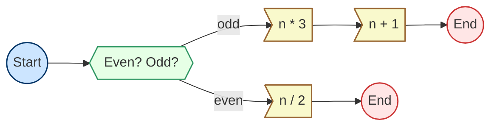

# Branching in Chain: A Case Study with Collatz Conjecture

Full test code available: [collatz.go](collatz.go)

Chain `Workflow`s support branching logic, enabling conditional execution paths where subsequent `Action`s depend on prior results. This feature is particularly useful for problems where outcomes vary based on specific conditions.

This document illustrates how to implement a branching workflow using the Collatz Conjecture as an example. The workflow processes an integer input, deciding the next step based on whether the number is odd or even.

## Collatz Conjecture to Workflow

The Collatz Conjecture is defined mathematically as:

$$
f(n) = \begin{cases} n/2 &\text{if } n \equiv 0 \pmod{2},\\
3n+1 & \text{if } n\equiv 1 \pmod{2} .\end{cases}
$$

Each arithmetic operation (division, multiplication, or addition) is represented as a separate Action. Below is the implementation:

```golang
func checkNext() chain.Action[int] {
    branchFunc := func(_ context.Context, output int) (direction string, err error) {
        if output%2 == 0 {
            return "even", nil
        } else {
            return "odd", nil
        }
    }
    return chain.NewSimpleBranchAction("CheckNext", nil, []string{"even", "odd"}, branchFunc)
}

func half() chain.Action[int] {
    runFunc := func(_ context.Context, input int) (output int, err error) {
        return input / 2, nil
    }
    return chain.NewSimpleAction("Half", runFunc)
}

func triple() chain.Action[int] {
    runFunc := func(_ context.Context, input int) (output int, err error) {
        return input * 3, nil
    }
    return chain.NewSimpleAction("Triple", runFunc)
}

func inc() chain.Action[int] {
    runFunc := func(_ context.Context, input int) (output int, err error) {
        return input + 1, nil
    }
    return chain.NewSimpleAction("Inc", runFunc)
}

```

### Workflow Implementation

The workflow executes according to the following graph:



Here is the implementation for a basic Collatz Workflow:

```go
func basicCollatzFunction() *chain.Workflow[int] {
    branch, even, odd1, odd2 := checkNext(), half(), triple(), inc()

    workflow := chain.NewWorkflow("SimpleCollatz", branch, even, odd1, odd2)
    workflow.SetRunPlan(branch, chain.ActionPlan[int]{
        "even": even,
        "odd":  odd1,
    })
    workflow.SetRunPlan(even, chain.TerminationPlan[int]())
    workflow.SetRunPlan(odd1, chain.SuccessOnlyPlan(odd2))
    workflow.SetRunPlan(odd2, chain.TerminationPlan[int]())

    return workflow
}
```

### Debug logs for execution

Logs for an odd input:

```text
level=debug msg="chain: start running with `CheckNext`" runnerName=SimpleCollatz
level=debug msg="chain: `CheckNext` directs `odd`, selecting `Triple`" runnerName=SimpleCollatz
level=debug msg="chain: `Triple` directs `success`, selecting `Inc`" runnerName=SimpleCollatz
level=debug msg="chain: `Inc` directs `success`, selecting `termination`" runnerName=SimpleCollatz
```

Logs for an even input:

```text
level=debug msg="chain: start running with `CheckNext`" runnerName=SimpleCollatz
level=debug msg="chain: `CheckNext` directs `even`, selecting `Half`" runnerName=SimpleCollatz
level=debug msg="chain: `Half` directs `success`, selecting `termination`" runnerName=SimpleCollatz
```

## Shortcut form of the Collatz Conjecture to Workflow

The odd-number case in the Collatz sequence ultimately transitions into an even number. Combining these two steps simplifies the process:

$$
f(n) = \begin{cases} n/2 &\text{if } n \equiv 0 \pmod{2},\\
\frac{3n+1}{2} & \text{if } n\equiv 1 \pmod{2} .\end{cases}
$$

### Workflow Implementation

The revised flow is shown below:


Here’s the corresponding Workflow implementation:

```go
func shortcutCollatzFunction() *chain.Workflow[int] {
    branch, even, odd1, odd2 := checkNext(), half(), triple(), inc()

    workflow := chain.NewWorkflow("ShortcutCollatz", branch, even, odd1, odd2)
    workflow.SetRunPlan(branch, chain.ActionPlan[int]{
        "even": even,
        "odd":  odd1,
    })
    workflow.SetRunPlan(even, chain.TerminationPlan[int]())
    workflow.SetRunPlan(odd1, chain.SuccessOnlyPlan(odd2))
    workflow.SetRunPlan(odd2, chain.SuccessOnlyPlan(even))

    return workflow
}
```

### Debug logs for execution

Logs for an odd input:

```text
level=debug msg="chain: start running with `CheckNext`" runnerName=ShortcutCollatz
level=debug msg="chain: `CheckNext` directs `odd`, selecting `Triple`" runnerName=ShortcutCollatz
level=debug msg="chain: `Triple` directs `success`, selecting `Inc`" runnerName=ShortcutCollatz
level=debug msg="chain: `Inc` directs `success`, selecting `Half`" runnerName=ShortcutCollatz
level=debug msg="chain: `Half` directs `success`, selecting `termination`" runnerName=ShortcutCollatz
```

Logs for an even input:

```text
level=debug msg="chain: start running with `CheckNext`" runnerName=ShortcutCollatz
level=debug msg="chain: `CheckNext` directs `even`, selecting `Half`" runnerName=ShortcutCollatz
level=debug msg="chain: `Half` directs `success`, selecting `termination`" runnerName=ShortcutCollatz
```

