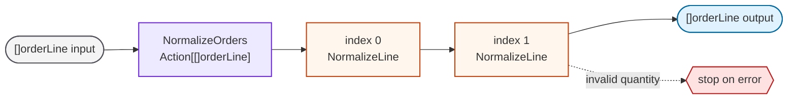
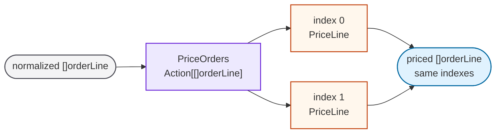
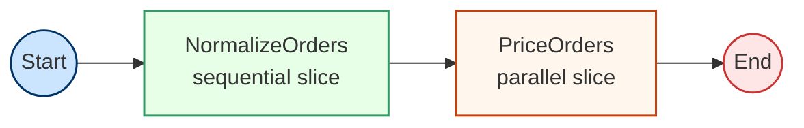
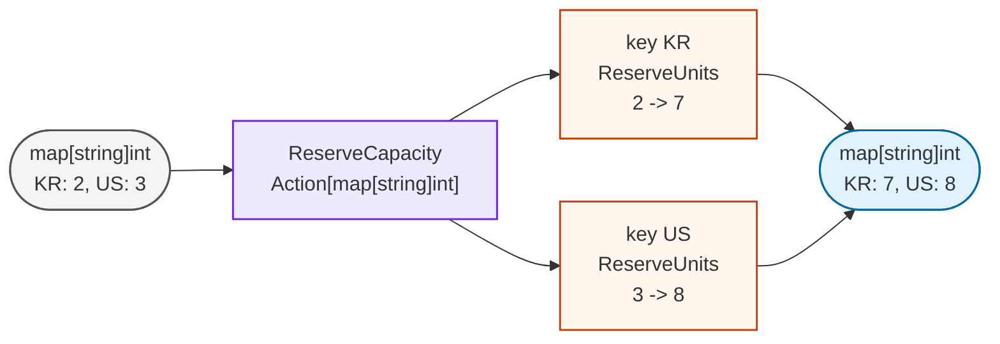

# Collection Actions in Chain: A Case Study with Order Pricing

Full implementation: [orders.go](orders.go)

A `chain.Action[T]` processes one value of type `T`. Real workflows often need
to apply the same action to a collection, such as a slice of order lines or a
map of regional capacities.

You could write a custom `Action[[]orderLine]` every time, but the logic is
usually the same:

- copy the collection
- run one item action per element
- preserve indexes or keys
- decide how to aggregate errors

Collection action builders provide that wrapper while keeping the item action
small and reusable.

## Order Line

This example prices a small list of order lines:

```go
type orderLine struct {
    id         string
    item       string
    quantity   int
    unitCents  int
    totalCents int
}
```

Two single-item actions do the actual work:

```go
func normalizeLine() chain.Action[orderLine]
func priceLine(catalog map[string]int) chain.Action[orderLine]
```

The workflow needs actions over `[]orderLine`, so each item action is wrapped
as a collection action.

## Sequential Slice Action

Normalization should happen in input order and stop before pricing if a line is
invalid. `AsSequenceSliceAction` turns `Action[orderLine]` into
`Action[[]orderLine]`.

```go
normalize := chain.AsSequenceSliceAction("NormalizeOrders", normalizeLine(), true)
```

The last argument is `stopOnError`. In this example it is `true`, so the first
invalid line stops the slice action.



`TestOrderValidation` verifies that an invalid quantity stops the workflow after
normalization, before the pricing action runs.

## Parallel Slice Action

After normalization, each line can be priced independently. `AsParallelSliceAction`
keeps the output indexes aligned with the input indexes.

```go
price := chain.AsParallelSliceAction("PriceOrders", priceLine(catalog))
```



## Order Pricing Workflow

The final slice workflow is just two collection actions:

```go
func newOrderWorkflow(catalog map[string]int) *chain.Workflow[[]orderLine] {
    normalize := chain.AsSequenceSliceAction("NormalizeOrders", normalizeLine(), true)
    price := chain.AsParallelSliceAction("PriceOrders", priceLine(catalog))

    return chain.NewWorkflow("OrderPricing", normalize, price)
}
```



`TestOrderWorkflow` verifies this path:

```text
raw order lines -> NormalizeOrders -> PriceOrders -> priced order lines
```

## Parallel Map Action

Map processing is separate from the order workflow so the map behavior stays
clear. `AsParallelMapAction` turns `Action[int]` into `Action[map[string]int]`.

```go
func newCapacityAction() chain.Action[map[string]int] {
    return chain.AsParallelMapAction[string]("ReserveCapacity", reserveUnits())
}
```

Each region value is processed independently, and the original keys are
preserved.



`TestCapacityMap` verifies that keys are preserved while values are processed in
parallel.
