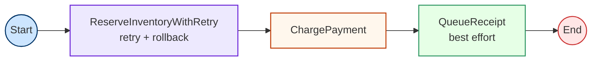

# Error Control in Chain: A Case Study with Checkout Recovery

Full implementation: [checkout.go](checkout.go)

A normal workflow moves through `Success`, `Failure`, or `Abort` based on each
action's result. That default is useful, but real workflows often need more
specific error behavior around a single step.

This checkout example has three steps:

1. reserve inventory
2. charge payment
3. queue a receipt email

The steps have different failure rules:

- inventory reservation may fail once and should be retried
- a failed reservation attempt must be rolled back before retrying
- receipt delivery is useful, but it should not fail an already-paid checkout

Error-control actions wrap a normal action and change how its error affects the
workflow.

## Checkout State

```go
type checkout struct {
    orderID             string
    item                string
    quantity            int
    reservedUnits       int
    reservationAttempts int
    chargedCents        int
    receiptQueued       bool
    events              []string
}
```

The type is private because the example package does not expose an API. It is
just state passed through a `Workflow[checkout]`.

## Retryable Reservation

The inventory action reserves units and then simulates a timeout on the first
attempt.

```go
func reserveInventory() chain.Action[checkout] {
    return chain.NewSimpleAction("ReserveInventory", func(_ context.Context, input checkout) (checkout, error) {
        input.reservationAttempts++
        input.reservedUnits += input.quantity
        input.events = append(input.events, fmt.Sprintf("reserved %d units of %s", input.quantity, input.item))

        if input.reservationAttempts == 1 {
            return input, errors.New("inventory service timeout")
        }
        return input, nil
    })
}
```

By itself, that error would move the workflow through `Failure`. The retryable
wrapper changes the behavior of this one step.

```go
reserve := chain.AsRetryableAction(
    "ReserveInventoryWithRetry",
    reserveInventory(),
    rollbackInventoryReservation(),
    2,
)
```



```mermaid
graph LR;
    classDef inputNode fill:#f4f4f5,stroke:#52525b,stroke-width:1.5px;
    classDef wrapperNode fill:#ede9fe,stroke:#6d28d9,stroke-width:1.5px;
    classDef actionNode fill:#fff7ed,stroke:#c2410c,stroke-width:1.5px;
    classDef rollbackNode fill:#fef9c3,stroke:#a16207,stroke-width:1.5px;
    classDef successNode fill:#dcfce7,stroke:#15803d,stroke-width:1.5px;
    classDef errorNode fill:#fee2e2,stroke:#b91c1c,stroke-width:1.5px;

    input(["checkout<br/>reservedUnits: 0"]):::inputNode
    wrapper["ReserveInventoryWithRetry<br/>Retryable Action"]:::wrapperNode
    attempt1["attempt 1<br/>ReserveInventory"]:::actionNode
    fail{{"inventory timeout"}}:::errorNode
    rollback["RollbackInventoryReservation<br/>reservedUnits: 2 -> 0"]:::rollbackNode
    attempt2["attempt 2<br/>ReserveInventory"]:::actionNode
    success(["checkout<br/>reservedUnits: 2"]):::successNode

    input --> wrapper
    wrapper --> attempt1
    attempt1 --> fail
    fail --> rollback
    rollback --> attempt2
    attempt2 --> success
```

The rollback action receives the failed attempt's output. In this example, the
failed attempt already incremented `reservedUnits`, so rollback subtracts it
before the next attempt.

## Best-Effort Receipt

Receipt delivery is different. The action should run, but its error should not
move the checkout workflow through `Failure`.

```go
receipt := chain.AsBestEffortAction(
    queueReceipt(),
    func(_ context.Context, input checkout, err error) {
        receipts.count++
        receipts.last = fmt.Errorf("order %s receipt failed after payment: %w", input.orderID, err)
    },
)
```

The wrapped action still returns its output. Only its error is suppressed, and
the fallback hook records the failure.

```mermaid
graph LR;
    classDef inputNode fill:#f4f4f5,stroke:#52525b,stroke-width:1.5px;
    classDef wrapperNode fill:#ede9fe,stroke:#6d28d9,stroke-width:1.5px;
    classDef actionNode fill:#fff7ed,stroke:#c2410c,stroke-width:1.5px;
    classDef fallbackNode fill:#fef9c3,stroke:#a16207,stroke-width:1.5px;
    classDef successNode fill:#dcfce7,stroke:#15803d,stroke-width:1.5px;
    classDef errorNode fill:#fee2e2,stroke:#b91c1c,stroke-width:1.5px;

    input(["checkout<br/>chargedCents: 5000"]):::inputNode
    wrapper["BestEffort QueueReceipt<br/>exposes Success"]:::wrapperNode
    action["QueueReceipt<br/>receiptQueued: true"]:::actionNode
    err{{"email provider unavailable"}}:::errorNode
    fallback["fallback hook<br/>record failure"]:::fallbackNode
    success(["checkout continues<br/>error suppressed"]):::successNode

    input --> wrapper
    wrapper --> action
    action --> err
    err --> fallback
    fallback --> success
```



## Checkout Workflow

The final workflow remains linear. The wrappers hide the local error-control
details behind normal `Action[checkout]` values.

```go
func newCheckoutWorkflow(receipts *receiptFailures) *chain.Workflow[checkout] {
    reserve := chain.AsRetryableAction(
        "ReserveInventoryWithRetry",
        reserveInventory(),
        rollbackInventoryReservation(),
        2,
    )
    charge := chargePayment(2500)
    receipt := chain.AsBestEffortAction(queueReceipt(), fallback)

    return chain.NewWorkflow("Checkout", reserve, charge, receipt)
}
```



`TestCheckoutRecovery` verifies this path:

```text
reserve attempt 1 -> rollback -> reserve attempt 2 -> charge -> queue receipt
```

The test asserts that checkout succeeds, payment is charged, receipt queuing
ran, and the best-effort fallback recorded the receipt provider failure.
