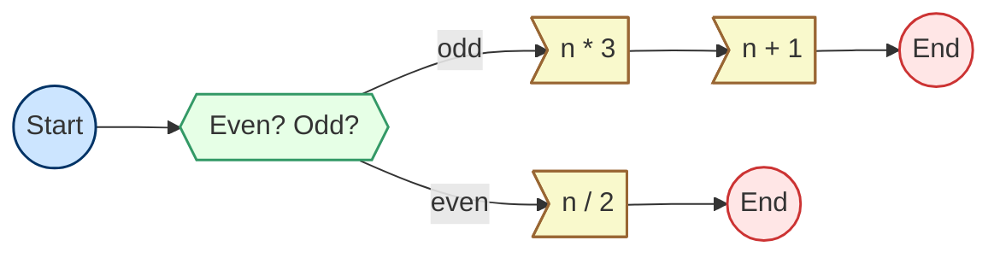

# Branching in Railway: A Case Study with Collatz Conjecture

Full test code available: [example_branch_pipeline_test.go](example_branch_pipeline_test.go)

Railway `Pipeline`s support branching logic, enabling conditional execution paths where subsequent `Action`s depend on prior results. This feature is particularly useful for problems where outcomes vary based on specific conditions.

This document illustrates how to implement a branching pipeline using the Collatz Conjecture as an example. The pipeline processes an integer input, deciding the next step based on whether the number is odd or even.

## Collatz Conjecture to Pipeline

The Collatz Conjecture is defined mathematically as:

$$
f(n) = \begin{cases} n/2 &\text{if } n \equiv 0 \pmod{2},\\
3n+1 & \text{if } n\equiv 1 \pmod{2} .\end{cases}
$$

Each arithmetic operation (division, multiplication, or addition) is represented as a separate Action. Below is the implementation:

```golang
func checkNext() railway.Action[int] {
    branchFunc := func(_ context.Context, output int) (direction string, err error) {
        if output%2 == 0 {
            return "even", nil
        } else {
            return "odd", nil
        }
    }
    return railway.NewSimpleBranchAction("CheckNext", nil, []string{"even", "odd"}, branchFunc)
}

func half() railway.Action[int] {
    runFunc := func(_ context.Context, input int) (output int, err error) {
        return input / 2, nil
    }
    return railway.NewSimpleAction("Half", runFunc)
}

func triple() railway.Action[int] {
    runFunc := func(_ context.Context, input int) (output int, err error) {
        return input * 3, nil
    }
    return railway.NewSimpleAction("Triple", runFunc)
}

func inc() railway.Action[int] {
    runFunc := func(_ context.Context, input int) (output int, err error) {
        return input + 1, nil
    }
    return railway.NewSimpleAction("Inc", runFunc)
}

```

### Pipeline Implementation

The pipeline executes according to the following graph:



Here is the implementation for a basic Collatz Pipeline:

```go
func basicCollatzFunction() *railway.Pipeline[int] {
    branch, even, odd1, odd2 := checkNext(), half(), triple(), inc()

    pipeline := railway.NewPipeline("SimpleCollatz", branch, even, odd1, odd2)
    pipeline.SetRunPlan(branch, railway.ActionPlan[int]{
        "even": even,
        "odd":  odd1,
    })
    pipeline.SetRunPlan(even, railway.TerminationPlan[int]())
    pipeline.SetRunPlan(odd1, railway.SuccessOnlyPlan(odd2))
    pipeline.SetRunPlan(odd2, railway.TerminationPlan[int]())

    return pipeline
}
```

### Debug logs for execution

Logs for an odd input:

```text
level=debug msg="SimpleCollatz: Start running with `CheckNext`"
level=debug msg="SimpleCollatz: `CheckNext` directs `odd`, selecting `Triple`"
level=debug msg="SimpleCollatz: `Triple` directs `success`, selecting `Inc`"
level=debug msg="SimpleCollatz: `Inc` directs `success`, selecting `termination`"
```

Logs for an even input:

```text
level=debug msg="SimpleCollatz: Start running with `CheckNext`"
level=debug msg="SimpleCollatz: `CheckNext` directs `even`, selecting `Half`"
level=debug msg="SimpleCollatz: `Half` directs `success`, selecting `termination`"
```

## Shortcut form of the Collatz Conjecture to Pipeline

The odd-number case in the Collatz sequence ultimately transitions into an even number. Combining these two steps simplifies the process:

$$
f(n) = \begin{cases} n/2 &\text{if } n \equiv 0 \pmod{2},\\
\frac{3n+1}{2} & \text{if } n\equiv 1 \pmod{2} .\end{cases}
$$

### Pipeline Implementation

The revised flow is shown below:


Here’s the corresponding pipeline implementation:

```go
func shortcutCollatzFunction() *railway.Pipeline[int] {
    branch, even, odd1, odd2 := checkNext(), half(), triple(), inc()

    pipeline := railway.NewPipeline("ShortcutCollatz", branch, even, odd1, odd2)
    pipeline.SetRunPlan(branch, railway.ActionPlan[int]{
        "even": even,
        "odd":  odd1,
    })
    pipeline.SetRunPlan(even, railway.TerminationPlan[int]())
    pipeline.SetRunPlan(odd1, railway.SuccessOnlyPlan(odd2))
    pipeline.SetRunPlan(odd2, railway.SuccessOnlyPlan(even))

    return pipeline
}
```

### Debug logs for execution

Logs for an odd input:

```text
level=debug msg="ShortcutCollatz: Start running with `CheckNext`"
level=debug msg="ShortcutCollatz: `CheckNext` directs `odd`, selecting `Triple`"
level=debug msg="ShortcutCollatz: `Triple` directs `success`, selecting `Inc`"
level=debug msg="ShortcutCollatz: `Inc` directs `success`, selecting `Half`"
level=debug msg="ShortcutCollatz: `Half` directs `success`, selecting `termination`"
```

Logs for an even input:

```text
level=debug msg="ShortcutCollatz: Start running with `CheckNext`"
level=debug msg="ShortcutCollatz: `CheckNext` directs `even`, selecting `Half`"
level=debug msg="ShortcutCollatz: `Half` directs `success`, selecting `termination`"
```

